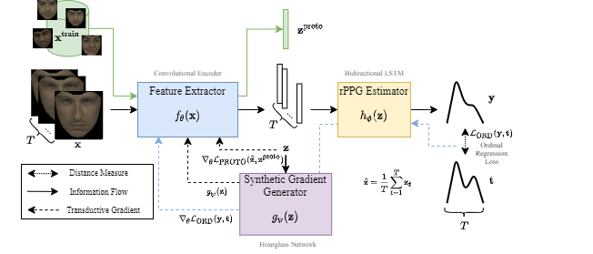

[](https://github.com/eugenelet/NeuralScale-Private/blob/master/LICENSE)


# Meta-rPPG: Remote Heart Rate Estimation Using a Transductive Meta-Learner

This repository is the official implementation of *Meta-rPPG: Remote Heart Rate Estimation Using a Transductive Meta-Learner* that has been accepted to ECCV 2020. 



## Heatmap Visualization

Left to right: 

1. Cropped input image
2. End-to-end trained model (baseline)
3. Meta-rPPG (transducive inference)
4. Top to down: rPPG signal, Power Spectral Density (PSD), Predicted and ground truth heart rate


## Requirements

To install requirements:

```setup
pip install -r requirements.txt
```

All experiments can be run on a single NVIDIA GTX1080Ti GPU.


The code was tested with python3.6 the following software versions:

| Software        | version | 
| ------------- |-------------| 
| cuDNN         | 7.6.5 |
| Pytorch      | 1.5.0  |
| CUDA | 10.2    |


## Training

### Training Data Preparation

Download training data ([example.pth](https://drive.google.com/file/d/1Z4GWiYjoQSXMYBhxBRZK9gUa1mYP0JsN/view?usp=sharing)) from Google Drive. Due to privacy issue (face images), provided data contains only a subset of the entire training data, i.e. contains faces of the authors of this paper.

Move `example.pth` to `data/` directory:
```
mv example.pth data/
```

### Begin Training

To begin training, run:

```
python3 train.py
```


## Validation Data

Validation data can be requested from:

[MAHNOB-HCI](https://mahnob-db.eu/hci-tagging/)

[UBFC-rPPG](https://sites.google.com/view/ybenezeth/ubfcrppg)


## Contributing

If you find this work useful, consider citing our work using the following bibTex:
```
@inproceedings{lee2020meta,
	title={Meta-rPPG: Remote Heart Rate Estimation Using a Transductive Meta-Learner},
	author={Lee, Eugene and Chen, Evan and Lee, Chen-Yi},
	booktitle={European Conference on Computer Vision (ECCV)},
	year={2020}
}
```

Code Flow (original): train.py
* Get options from parser
* Build network
* Load train dataset to memory
* Set network input
* For each epoch:
	* Adaptation phase
	* Learning phase
	* Validation phase
	* Update prototype
	* Save network
	* Update learning rate

Code Flow (adapted)
* Get options from parser: No major updates.
* Build network. Updates:
	* The `evaluate` method was created. It looks like the `test` method, but doesn't updates the `self.t_ordloss`.
	* Inside the `get_current_results` method, the test return turns into a dictionary.

Main paper points:

Current advances in meta-learning have shed light on the techniques of designing and training a deep neural network (DNN) that is able to adapt to new tasks through minimal weight changes. **As prior work in meta-learning is built on well-defined tasks consisting of the classification of a few labeled examples (shots) provided as support set during test time for fast adaptation, it can’t be directly applied to our context as labeled data are unobtainable during deployment.**

In our work, we split our DNN into two parts: a feature extractor and a rPPG estimator modeled by a convolutional neural network (CNN) and long short-term memory (LSTM) [17] network respectively. 

1. In Section 3, we propose a meta-learning framework that exploits spatiotemporal information for remote heart rate estimation, specifically designed for fast adaptation to new video sequences during deployment.
2. In Section 3.2, we introduce a transductive inference method that makes use of unlabeled data for fast adaptation during deployment using a synthetic gradient generator and a novel prototypical distance minimizer.
3. In Section 3.3, we propose the formulation of rPPG estimation as an ordinal regression problem to cope with the mismatch in temporal domain of both visual input and collected PPG data.
4. In Section 4, we validate our proposed methods empirically on two public face heart rate dataset (MAHNOB-HCI and UBFC-rPPG), trained using our collected dataset. Our experimental results demonstrate that our approach outperforms existing methods on remote heart rate estimation.

In our work, the parameters of our network is divided into two parts where one is responsible for fast adaptation and the other only responsible for estimation.